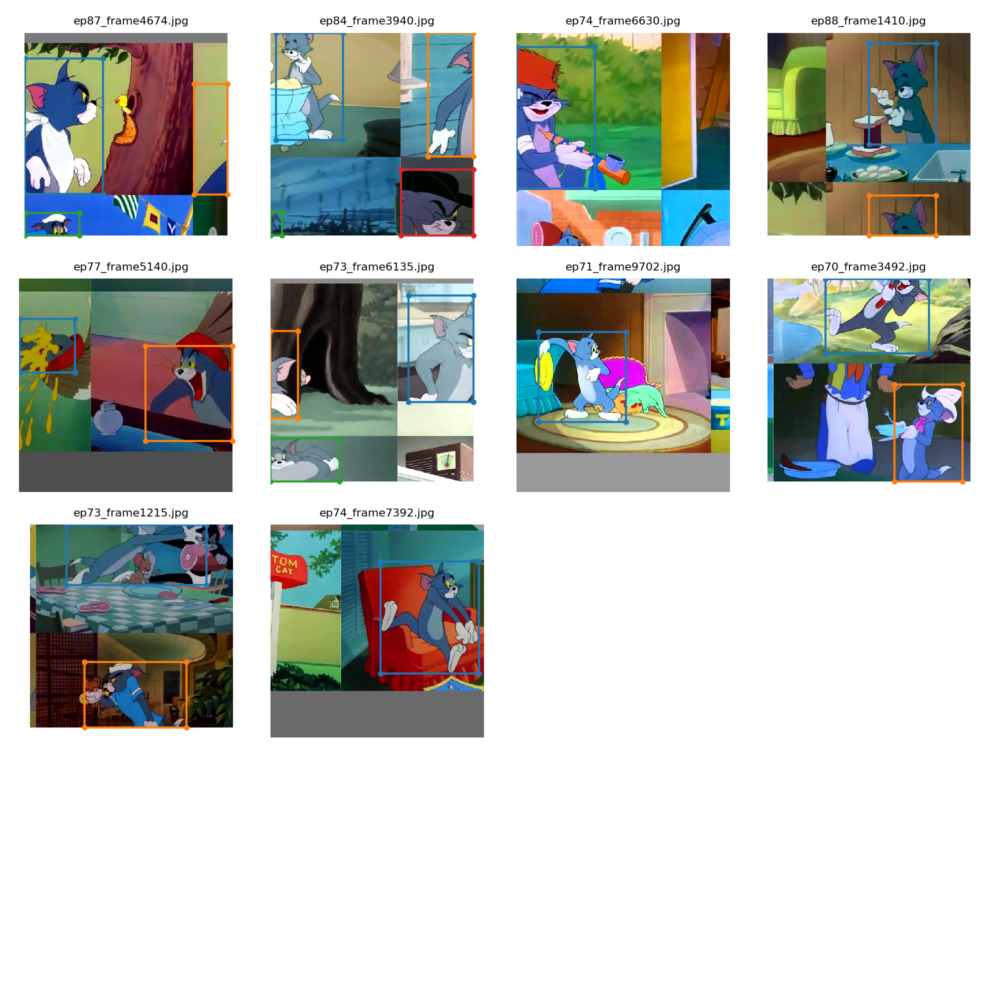
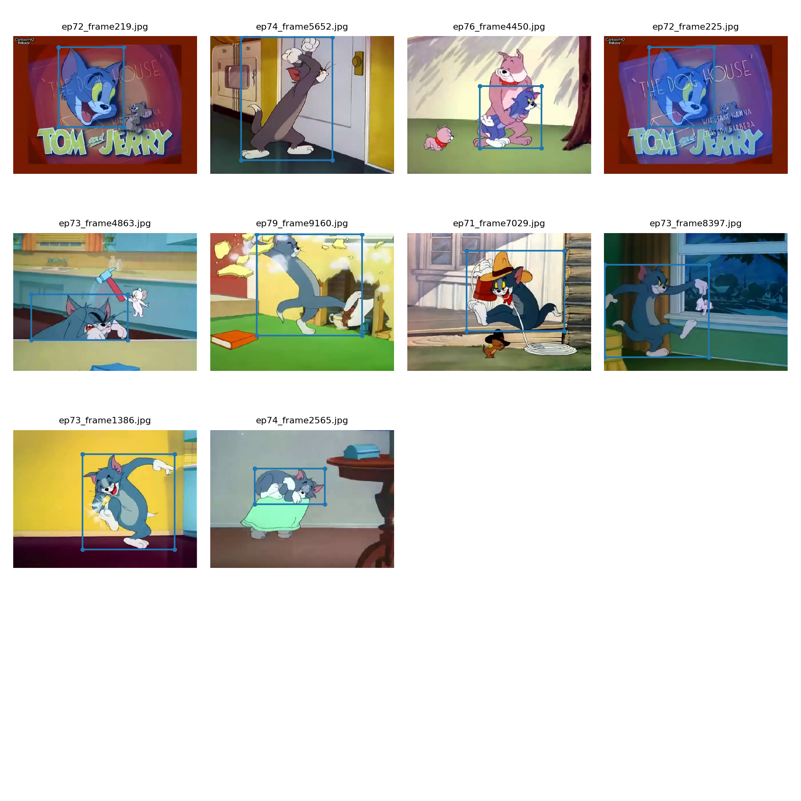

### Tom Detector using YOLOv3

This project uses the YOLOv3 implementation of [Ultralytics](https://github.com/ultralytics/yolov3), and finetunes on the pretrained weights using the [ToCaD](https://github.com/HarshaVardhanMA/Tom-the-Cat-Dataset-ToCaD-for-Object-Detection) dataset to perform Tom Detection.
(Hence, you can use this as a tutorial to use the [ToCaD](https://github.com/HarshaVardhanMA/Tom-the-Cat-Dataset-ToCaD-for-Object-Detection) dataset as well)

Find the training logs [here](train.log) and result logs [here](results.txt). 

The pretrained model was finetuned on ToCaD for 300 epochs on an NVIDIA 1080ti GPU. 

A sample training batch

A sample testing batch

Metrics

Final remarks:
This is a team project built as an assignment in the 'Extensive Vision AI (EVA)' program conducted by 'The School of AI (TSAI)'.

Find my team mates' details below:

- [Tusharkant Biswal](mailto:Tusharkanta_biswal@stragure.com) 
- [V N G Suman Kanukollu](mailto:sumankanukollu@gmail.com)
- [Praveen Raghuvanshi](mailto:praveenraghuvanshi@gmail.com)

This work was done as a tribute to the late Gene Deitch, who was one of the directors of the iconic series "Tom and Jerry".
Find the tribute video generated using this project on [YouTube](https://www.youtube.com/watch?v=7_lH-jFB0Cg).

Credits:

[The School of AI (YOLOv3)](https://github.com/theschoolofai/YoloV3)
[Ultralytics YOLOv3](https://github.com/ultralytics/yolov3)

